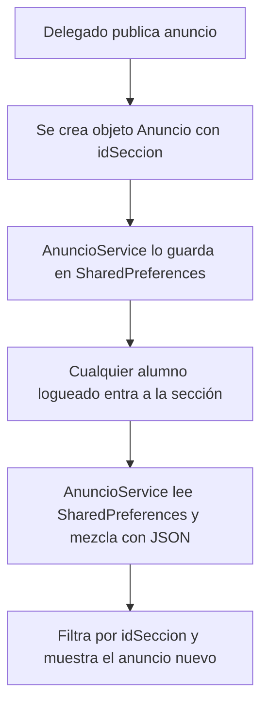

# Análisis y Plan de Trabajo: Conexión de Anuncios del Delegado

¡Entendido perfectamente! Disculpa la confusión anterior. Vamos a ajustar el alcance exactamente a lo que necesitas:
1. **Pospuesto**: La sección de estadísticas se deja para el final (no la tocaremos por ahora).
2. **Descartado**: La parte de asistencia no se modificará, ya que no corresponde a tus pantallas.
3. **Prioridad Absoluta**: Conectar correctamente los anuncios de la sección del delegado para que cualquier alumno de esa sección los visualice inmediatamente.

Este documento actualizado detalla cómo funciona esta conexión de datos en tu código de forma sencilla y transparente para tu exposición.

---

## 1. ¿Cómo Funciona la Conexión de Anuncios en tu App?

Dado que estás desarrollando una aplicación móvil sin base de datos en la nube (backend real), la comunicación entre el delegado y los alumnos se simula a nivel local usando **SharedPreferences** a través del `StorageService`.

La lógica compartida opera así:


Como la memoria local (`SharedPreferences`) es compartida por la aplicación en el dispositivo, cuando simules el flujo:
1. Inicias sesión como **Delegado** (ej. Martín Rodrigo).
2. Publicas un anuncio en la sección `PM-854` (Programación Móvil).
3. Cierras sesión e inicias sesión como **Estudiante** (ej. Carlos Mendoza, matriculado en `PM-854`).
4. Al entrar a los detalles del curso de Programación Móvil, el anuncio que creó el delegado **aparecerá ahí automáticamente** porque ambos leen de la misma memoria del teléfono filtrando por la sección.

---

## 2. Lo que Implementaremos (Paso a Paso)

Para lograr esta conexión, realizaremos cambios en dos archivos principales:

### A. Modificación del Controlador del Delegado: [delegado_anuncios_controller.dart](file:///c:/Users/ACER/Desktop/Progra%20Movil%20General/PrograMovil/lib/pages/delegado_anuncios/delegado_anuncios_controller.dart)
Modificaremos la función `publicarAnuncioPendiente()` para realizar las siguientes acciones:
1. Validar que el título y mensaje no estén vacíos.
2. Obtener el usuario actual logueado mediante `AuthService.to.currentUser`.
3. Formatear la fecha actual (ej. `04/06/2026`).
4. Generar un ID único simple (usando la marca de tiempo `DateTime.now().millisecondsSinceEpoch.toString()`).
5. Instanciar el modelo `Anuncio` con estos datos.
6. Llamar a `AnuncioService().addAnuncio(nuevoAnuncio)`.
7. Si se guarda con éxito, mostrar un snackbar informativo, limpiar el formulario y regresar a la pantalla anterior con `Get.back()`.

### B. Modificación de la Vista del Delegado: [delegado_anuncios_page.dart](file:///c:/Users/ACER/Desktop/Progra%20Movil%20General/PrograMovil/lib/pages/delegado_anuncios/delegado_anuncios_page.dart)
* Asegurar que el botón "Publicar Anuncio" llame correctamente al controlador. (Actualmente ya llama a `control.publicarAnuncioPendiente`).

---

## 3. Código Conceptual de la Publicación (Muy Fácil de Explicar)

Este es el bloque de código que usaremos en tu controlador. Es muy claro y utiliza funciones estándar de Dart:

```dart
void publicarAnuncio() async {
  // 1. Validación básica
  if (titulo.text.trim().isEmpty || mensaje.text.trim().isEmpty) {
    Get.snackbar(
      'Campos vacíos',
      'Por favor, ingresa un título y un mensaje para el anuncio.',
      snackPosition: SnackPosition.BOTTOM,
      backgroundColor: Colors.redAccent,
      colorText: Colors.white,
    );
    return;
  }

  // 2. Obtener datos del autor
  final usuario = AuthService.to.currentUser;
  if (usuario == null) return;

  // 3. Obtener fecha actual en formato DD/MM/AAAA
  final ahora = DateTime.now();
  final fechaFormateada = "${ahora.day}/${ahora.month}/${ahora.year}";

  // 4. Crear el objeto Anuncio
  final nuevoAnuncio = Anuncio(
    id: DateTime.now().millisecondsSinceEpoch.toString(), // ID único basado en el tiempo
    idSeccion: idSeccion,
    titulo: titulo.text.trim(),
    mensaje: mensaje.text.trim(),
    fecha: fechaFormateada,
    autorCode: usuario.code,
    autorName: usuario.fullName,
    autorRole: rol,
  );

  // 5. Guardar mediante el servicio
  final response = await AnuncioService().addAnuncio(nuevoAnuncio);

  if (response.success) {
    Get.snackbar(
      'Éxito',
      'Anuncio publicado correctamente.',
      snackPosition: SnackPosition.BOTTOM,
      backgroundColor: Colors.green,
      colorText: Colors.white,
    );
    
    // Limpiar campos
    titulo.clear();
    mensaje.clear();

    // Regresar a la pantalla anterior (donde está la lista de cursos del delegado)
    Get.back();
  } else {
    Get.snackbar(
      'Error',
      'No se pudo publicar el anuncio.',
      snackPosition: SnackPosition.BOTTOM,
      backgroundColor: Colors.red,
      colorText: Colors.white,
    );
  }
}
```

---

## 4. Guía para tu Exposición sobre esta Conexión

Si el profesor te pregunta cómo se conectan los anuncios entre el delegado y los alumnos, tu respuesta debe ser estructurada y directa:

> *"Profesor, la conexión funciona a través de un servicio centralizado llamado `AnuncioService`:"*
>
> 1. *"Cuando el **delegado** publica un anuncio en su panel, el controlador captura los textos de los formularios, obtiene el código y nombre del delegado logueado en ese momento (mediante `AuthService`) y guarda el anuncio en las SharedPreferences (memoria local persistente del dispositivo) usando el método `addAnuncio`."*
> 2. *"Cuando cualquier **alumno** matriculado en esa sección inicia sesión y abre el curso, la vista llama a `fetchAnuncios(idSeccion)` del mismo servicio. Este servicio recupera tanto los anuncios del archivo JSON estático como los anuncios nuevos guardados en SharedPreferences, los filtra por el código de sección del curso y los muestra ordenados de más reciente a más antiguo."*
> 3. *"De esta manera, simulamos una comunicación en tiempo real en la base de datos de manera reactiva gracias a que GetX actualiza la lista visual inmediatamente al cambiar el estado."*

---

¿Me confirmas si ahora sí estamos totalmente alineados? Si es así, indícame si deseas que proceda a realizar esta modificación en los archivos de tu proyecto.
